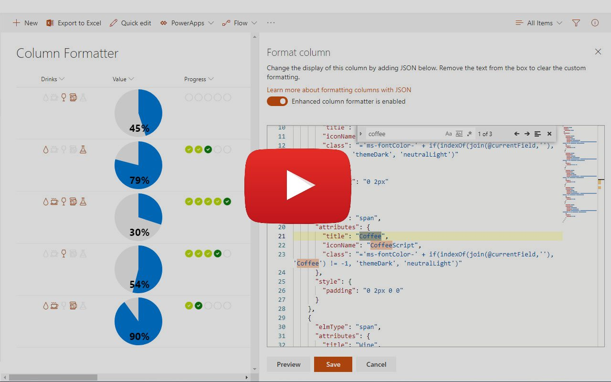

# SP Formatter

Customize your SharePoint Column or View Formatting JSON using full-featured editor instead of default one. Supports [Google Chrome](https://chrome.google.com/webstore/detail/sp-formatter/fmeihfaddhdkoogipahfcjlicglflkhg?hl=en) and [Microsoft Edge (Chromium)](https://microsoftedge.microsoft.com/addons/detail/sp-formatter/eenbldkdgbfcfachaccldfgiajgjmjhi?hl=en-US).

[Watch video](https://youtu.be/xnyiDdLKWOA)

## SP Formatter editor features

- Live Preview as you type (no need to click "Preview" button)
- Intellisense (suggestions) based on Column or View formatting schema, CSS styles, replaceable tokens (`@currentField`, list fields with `$` based on the context)
- JSON validation with error messages in the editor
- Help tooltips for JSON properties
- Color highlights
- Line numbers, brace matching, collapsible regions
- Hotkeys: search, replace, format document, go to line and more (read more on hotkeys further below)
- Easily switch between default and enhanced editor
- VSCode integration
- Split screen mode

## Supported platforms

- SharePoint Online
- SharePoint 2019

## Some useful HOT KEYS

- CTRL + F: Search  
- CTRL + Space: Explicitly request suggestions  
- CTRL + G: Go to line  
- SHIFT + ALT + F: Format document  
- F1: Show command palette  
 ... and some others available in VSCode's monaco editor.

## VSCode integration mode

You can edit your Column Formatting JSON inside VSCode and have it synchronized to a browser with live preview.

### Prerequisites

- [SP Formatter](https://marketplace.visualstudio.com/items?itemName=s-kainet.sp-formatter) VSCode extension needs to be installed.
- http port `11232` to be opened for connections

### How to configure

1. In VSCode open desired file with Column Formatting JSON (a file should have `.json` extension)
2. Right click on a file and run `SP Formatter: start a new session` command
3. Launch your browser with SP Formatter web extension. Enable SP Formatter and open any json formatting on a SharePoint page.
4. Wait for `VSCode is connected` message with a file name from VSCode instance.
5. Edit file in VSCode and see live results in a browser.

### PRIVACY POLICY  

SP Formatter does not collect nor store any personal data.
