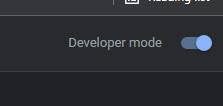
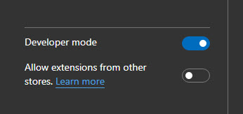
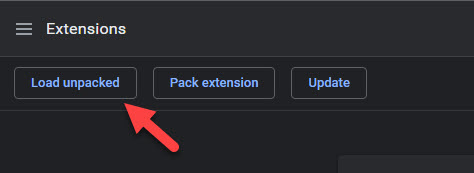
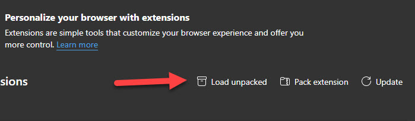

# SP 2019 Formatter

> IMPORTANT! This is the SP Formatter version, which works only for SharePoint 2019

To work with SharPoint 2019 you should install this extension manually first.

## How to install

The extension is not listed in the Chrome or Edge extensions store, but you can sideload it manually.

1. In your browser go to the Extensions screen and enable `Developer mode`:

    Chrome            |  Edge
    :-------------------------:|:-------------------------:
      |  

2. Go to the [Releases](https://github.com/pnp/sp-formatter/releases) page and download the latest SP 2019 Formatter extension (`sp.2019.formatter.zip` package). Extract it into the known folder.

3. Click `Load unpacked` to load unpacked extension from the folder where you extracted the zip archive.

    Chrome            |  Edge
    :-------------------------:|:-------------------------:
      |  

4. Enjoy it!

---

Customize your SharePoint Column Formatting JSON using full-featured editor instead of default one. Supports [Google Chrome](https://chrome.google.com/webstore/detail/sp-formatter/fmeihfaddhdkoogipahfcjlicglflkhg?hl=en) and [Microsoft Edge (Chromium)](https://microsoftedge.microsoft.com/addons/detail/sp-formatter/eenbldkdgbfcfachaccldfgiajgjmjhi?hl=en-US).

[Watch video](https://youtu.be/xnyiDdLKWOA)

## SP Formatter editor features

- Live Preview as you type (no need to click "Preview" button)
- Intellisense (suggestions) based on Column or View formatting schema, CSS styles, replaceable tokens (`@currentField`, list fields with `$` based on the context)
- JSON validation with error messages in the editor
- Help tooltips for JSON properties
- Color highlights
- Line numbers, brace matching, collapsible regions
- Hotkeys: search, replace, format document, go to line and more (read more on hotkeys further below)
- Easily switch between default and enhanced editor
- VSCode integration
- Split screen mode

## Supported platforms

- SharePoint Online
- SharePoint 2019

## Some useful HOT KEYS

- CTRL + F: Search  
- CTRL + Space: Explicitly request suggestions  
- CTRL + G: Go to line  
- SHIFT + ALT + F: Format document  
- F1: Show command palette  
 ... and some others available in VSCode's monaco editor.

## VSCode integration mode

You can edit your Column Formatting JSON inside VSCode and have it synchronized to a browser with live preview.

### Prerequisites

- [SP Formatter](https://marketplace.visualstudio.com/items?itemName=s-kainet.sp-formatter) VSCode extension needs to be installed.
- http port `11232` to be opened for connections

### How to configure

1. In VSCode open desired file with Column Formatting JSON (a file should have `.json` extension)
2. Right click on a file and run `SP Formatter: start a new session` command
3. Launch your browser with SP Formatter web extension. Enable SP Formatter and open any json formatting on a SharePoint page.
4. Wait for `VSCode is connected` message with a file name from VSCode instance.
5. Edit file in VSCode and see live results in a browser.

### Known issues

1. If you have SP Formatter web extension enabled and navigate between different SharePoint pages, SP Formatter might not work properly (or not work at all).  

    SP Formatter "loses" context when you navigate between SharePoint pages in a same browser tab because of the async navigation nature in SPO. It's hard to track such navigation from the extension code.

    > **How to fix:** Just open a page, where you're going to format view\columns and perform a page refresh (F5) or hard refresh (CTRL + F5). Now SP Formatter should work as normal

### PRIVACY POLICY  

SP Formatter does not collect nor store any personal data.
